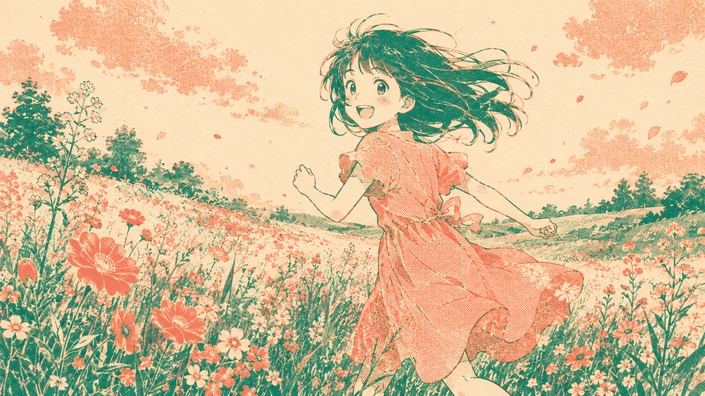
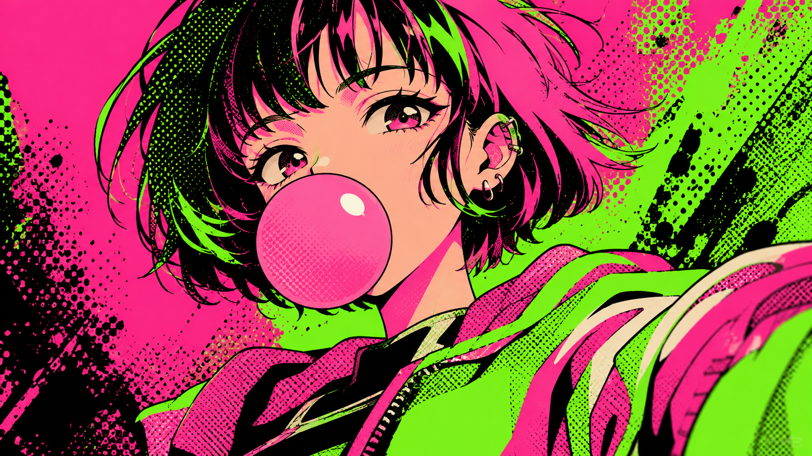
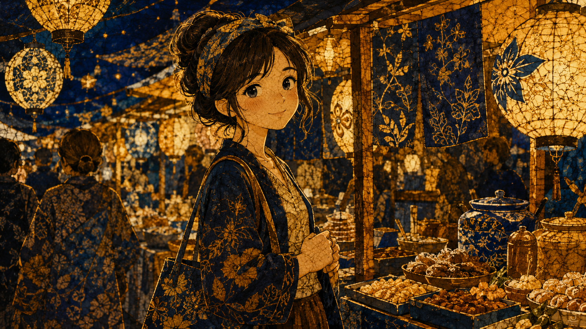
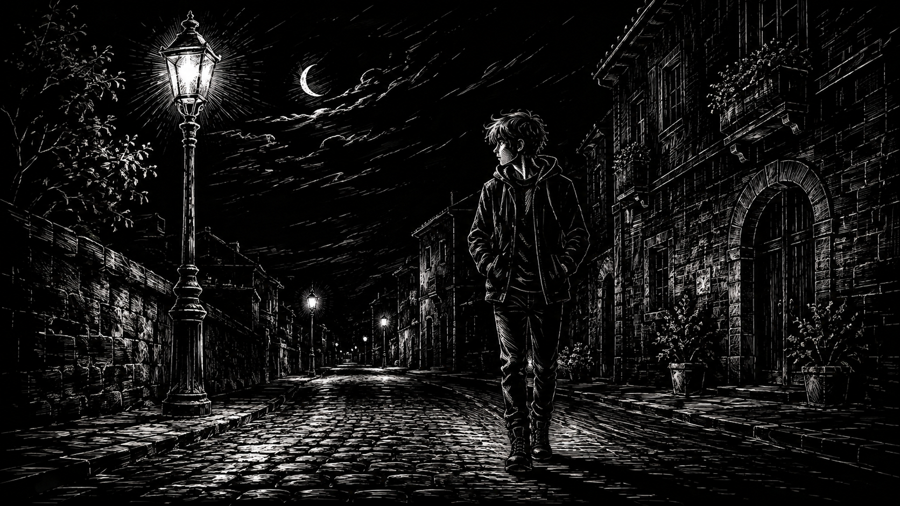
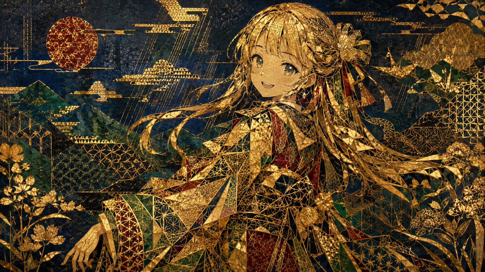
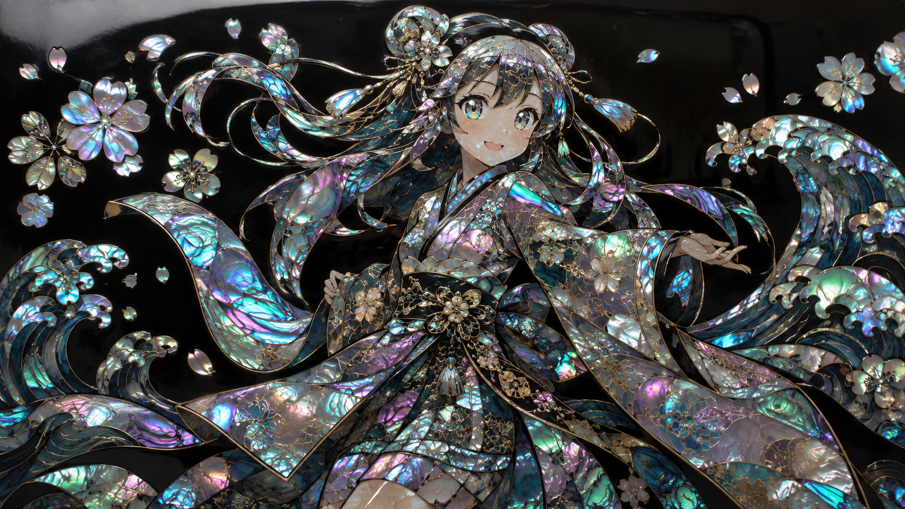
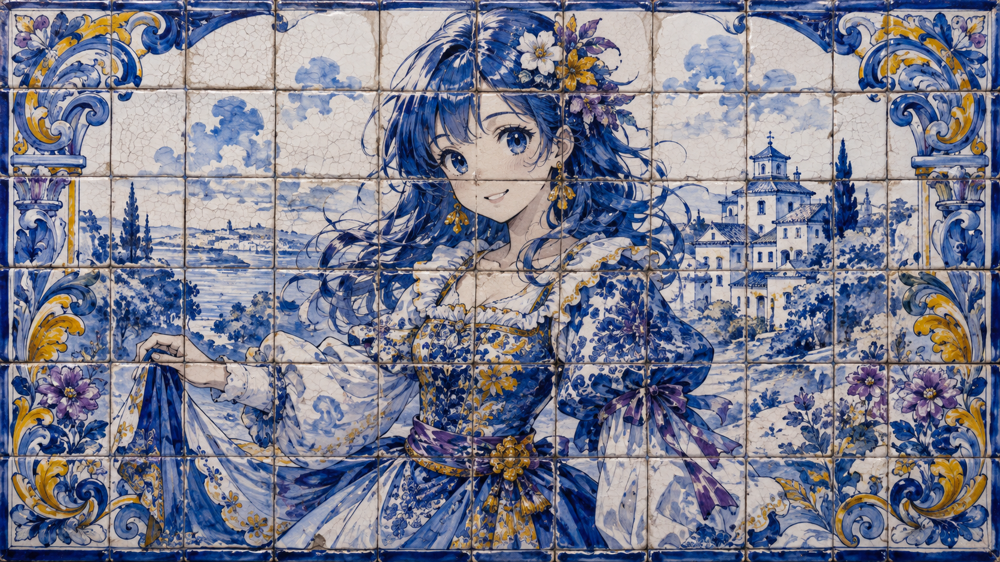
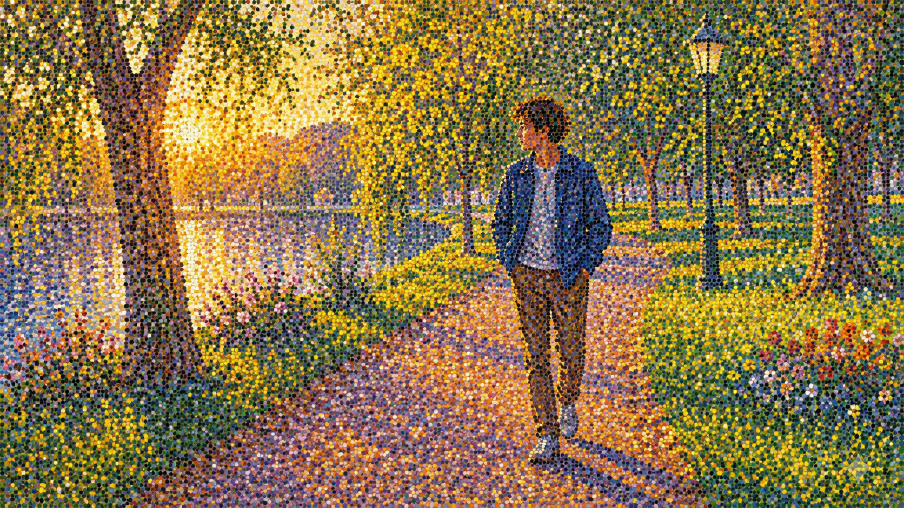

# Style Atlas · 风格图鉴

[](https://dracohu2025-cloud.github.io/art-styles/)
[](https://github.com/dracohu2025-cloud/art-styles/stargazers)

**Style-first 16:9 art atlas.** Characters may differ; each still is one dominant technique — not a character sheet, not a theme pack.

**[Live gallery →](https://dracohu2025-cloud.github.io/art-styles/)** · **[★ Star this repo](https://github.com/dracohu2025-cloud/art-styles)**

English primary, Chinese secondary (`name_en` / `name_zh`). Original characters only.

## Featured styles · 精选画风

Ten techniques chosen to look as different from each other as the catalog gets — print, craft, neon, gold leaf, nacre, tile, wax-resist, and carved black.

<table>
  <tr>
    <td align="center" width="50%">
      <a href="https://dracohu2025-cloud.github.io/art-styles/"></a><br />
      <strong>Stained Glass</strong><br /><sub>彩绘玻璃</sub>
    </td>
    <td align="center" width="50%">
      <a href="https://dracohu2025-cloud.github.io/art-styles/"></a><br />
      <strong>Risograph</strong><br /><sub>孔版印刷</sub>
    </td>
  </tr>
  <tr>
    <td align="center">
      <a href="https://dracohu2025-cloud.github.io/art-styles/"></a><br />
      <strong>Neon Halftone</strong><br /><sub>霓虹网点</sub>
    </td>
    <td align="center">
      <a href="https://dracohu2025-cloud.github.io/art-styles/"></a><br />
      <strong>Batik</strong><br /><sub>蜡染</sub>
    </td>
  </tr>
  <tr>
    <td align="center">
      <a href="https://dracohu2025-cloud.github.io/art-styles/"></a><br />
      <strong>Mezzotint</strong><br /><sub>美柔汀</sub>
    </td>
    <td align="center">
      <a href="https://dracohu2025-cloud.github.io/art-styles/"></a><br />
      <strong>Scratchboard</strong><br /><sub>刮画</sub>
    </td>
  </tr>
  <tr>
    <td align="center">
      <a href="https://dracohu2025-cloud.github.io/art-styles/"></a><br />
      <strong>Kirikane</strong><br /><sub>截金</sub>
    </td>
    <td align="center">
      <a href="https://dracohu2025-cloud.github.io/art-styles/"></a><br />
      <strong>Raden</strong><br /><sub>螺钿</sub>
    </td>
  </tr>
  <tr>
    <td align="center">
      <a href="https://dracohu2025-cloud.github.io/art-styles/"></a><br />
      <strong>Azulejo</strong><br /><sub>阿兹勒霍</sub>
    </td>
    <td align="center">
      <a href="https://dracohu2025-cloud.github.io/art-styles/"></a><br />
      <strong>Pointillism</strong><br /><sub>点彩</sub>
    </td>
  </tr>
</table>

[Browse 100+ stills in the live gallery →](https://dracohu2025-cloud.github.io/art-styles/)

## At a glance

| | |
|---|---|
| Catalog | **100+** technique stills, and growing |
| Frame | Native **16:9** (1672×941) — unmodified imports |
| Labels | Bilingual `name_en` / `name_zh` — true art-style keywords, never subject titles |
| Growth | Hermes-explore batches of five new techniques at a time |

## Preview

```bash
npm install
npm run dev
```

Production:

```bash
npm run build
npm run preview
```

`npm run build` / `npm run dev` first generate WebP grid thumbs, then start Vite. Vite `base` is `/art-styles/` for GitHub Pages project site.

## Thumbnails

The live grid must not load the native 1672×941 PNGs. Thumbs are **generated**, not committed:

```bash
npm run thumbs           # skip up-to-date thumbs
npm run thumbs -- --force
```

| | |
|---|---|
| Source | `public/styles/*.png` (top-level only) |
| Output | `public/styles/thumbs/<basename>.webp` (gitignored) |
| Size | 400px wide, WebP quality 70 |
| Grid | `styles/thumbs/<file>.webp` |
| Lightbox | original `styles/<file>.png` |

Regenerate after adding or replacing stills. GitHub Actions runs `npm run thumbs` as part of `npm run build`. The gallery window-virtualizes the grid (`@tanstack/react-virtual`) so only near-viewport cards mount.

## Catalog

| Path | Role |
|---|---|
| `styles/styles.json` | `id`, `slug`, `name_en`, `name_zh`, descriptions, `source`, `image` |
| `public/styles/<file>.png` | Native 16:9 stills, unmodified imports |
| `public/styles/thumbs/<file>.webp` | Generated 400px grid thumbs (`npm run thumbs`) |

Sources imported (REJECT files and `strips/` skipped):

- `creative` — 15 craft / print / material styles
- `style-diverge` — 28 graphic / anime style studies
- `hermes-explore` — ongoing technique batches (gouache, mezzotint, kirikane, raden, azulejo, …)

## Stack

Vite + React + TypeScript. Window-virtualized gallery (`@tanstack/react-virtual`). Deployed from `main` via GitHub Actions → Pages.
